```{r setup, include=FALSE}
knitr::opts_chunk$set(echo = FALSE)

#Librerias:
library(tidyverse)
library(tibble)
library(dplyr)
library(stringr)
library(osmdata)
library(sf)
library(tmap)
library(fontawesome)
#Datos:
datos <- read.csv2("../PostersCPA/Analisis_Postersv4.csv", sep = "\t")

#Funciones 

#Funcion para pasar a frecuencia, los valores absolutos.
pasar_n_a_proporcion <- function(x){ #recibe $n | devuelve vector para colocar en $proporcion
  total <- sum(x)
  i <- 1
  for (variable in x) {
    x[i] <- x[i] / total
    i <- i +1
  }
  return(x)
}
```

## Agroecología: Nuevo paradigma agroproductivo

<!-- \small  -->

<!-- Las consecuencias ambientales y sociales de la intervención humana sobre los ecosistemas han puesto de manifiesto la necesidad de un nuevo paradigma agroproductivo. -->

<!-- - La agroecología surge como una ciencia que permite abarcar los desafíos de la sustentabilidad de sistemas esencialmente complejos [@DiCiocco2011; @Sarandon2019]. -->


:::::::::::::: {.columns}
::: {.column width=45%}
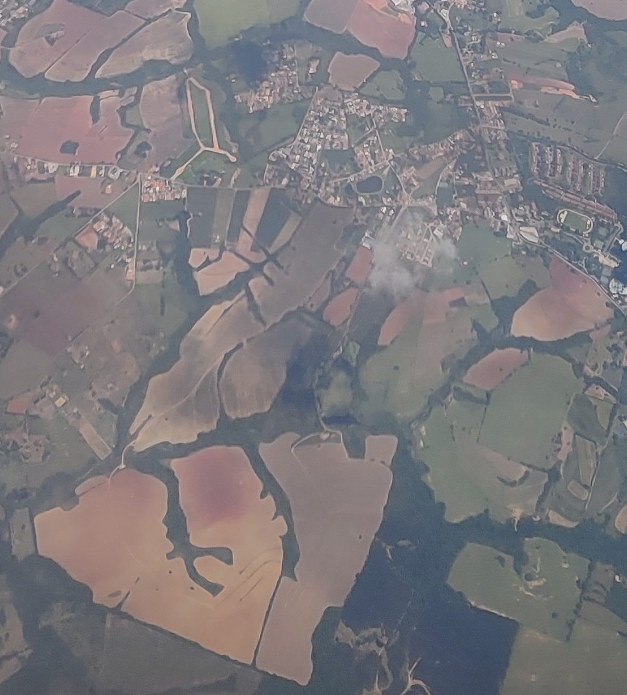
<!-- ::: -->
<!-- ::: {.column width="1%"} -->
<!-- \  -->
<!-- an empty Div (with a white space), serving as
a column separator -->
:::
::: {.column width="45%"}
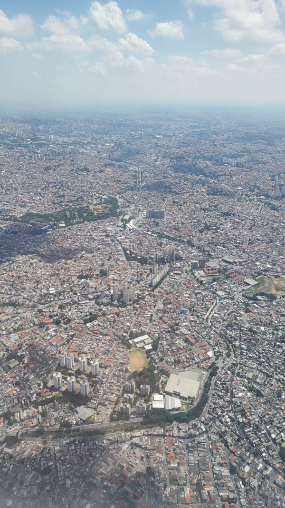
:::
::::::::::::::


## Bienes comunes

La información de tipo geográfica, tanto desde el conocimiento territorial de las y los ciudadanos como desde la producción que se realiza en las instituciones públicas constituyen **un bien común digital**, y por lo tanto es necesario "levantar" las barreras que dificultan su acceso haciendo estos datos de acceso libre [@Dufeal2017].


<!-- ## Introducción -->

<!-- En diversos lugares del mundo se han fortalecido organizaciones de productores y productoras que llevan adelante sus emprendimientos en el marco de la Agroecología, se han creado redes de comercialización y se han implementado sistemas participativos de certificación y de garantías [@Lemeilleur2020, @Fernandez2018] -->

<!-- ## Introducción -->

<!-- En conjunto con ello, se han sancionado normativas que limitan el uso de agroquímicos en diferentes jurisdicciones y se han iniciado procesos de reconversión de las producciones existentes.  -->

## Bienes comunes

Este proceso de promoción y fortalecimiento de planteos productivos novedosos se enmarca en un entorno sociocultural y ambiental de disputa con otros modelos productivos y del uso y apropiación de los recursos naturales y también de uso y apropiación de los saberes y conocimientos, en tanto bienes comunes.


## Participación de la comunidad

El conocimiento y análisis de estos procesos debe involucrar a sus actores:

productores, consumidores, sus organizaciones, en interacción con instituciones estatales específicas del sector agropecuario y las vinculadas a la educación y la investigación.

## Promoción de modelos alternativos

La promoción de modelos productivos alternativos debe ir unida a una apertura del acceso a la información.

<!-- local -->

<!-- de tipo geográfica, que  -->

La información relacionada no necesariamente está disponible abiertamente y tampoco es ajena a procesos de cercamiento y privatización.

<!-- * Antecedentes en general del uso de mapas para la agroecología. tomar del proyecto de extensión -->

## El mapeo de producciones agroecológicas 

<!-- Existen iniciativas de organizaciones sociales e instituciones públicas, en distintos municipios y regiones: -->

<!-- s (Tuchin, 2020; Red Interregional de Nodos Agroecológicos, 2023; Agencia de Extensión Mar del Plata - INTA y col., 2022; Inta Informa 2022). Sin embargo, todas se encuentran basadas en un servicio de mapas privado, la posibilidad de agregar o modificar información es limitada, y su descarga y reutilización no se encuentra necesariamente en un formato abierto. -->

\centering

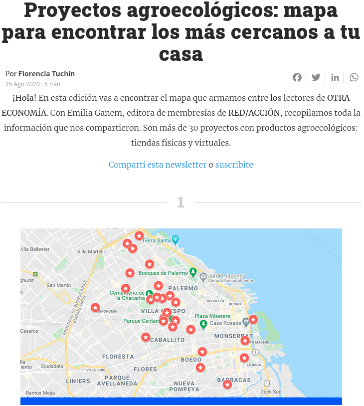{height=8cm}

## El mapeo de producciones agroecológicas 


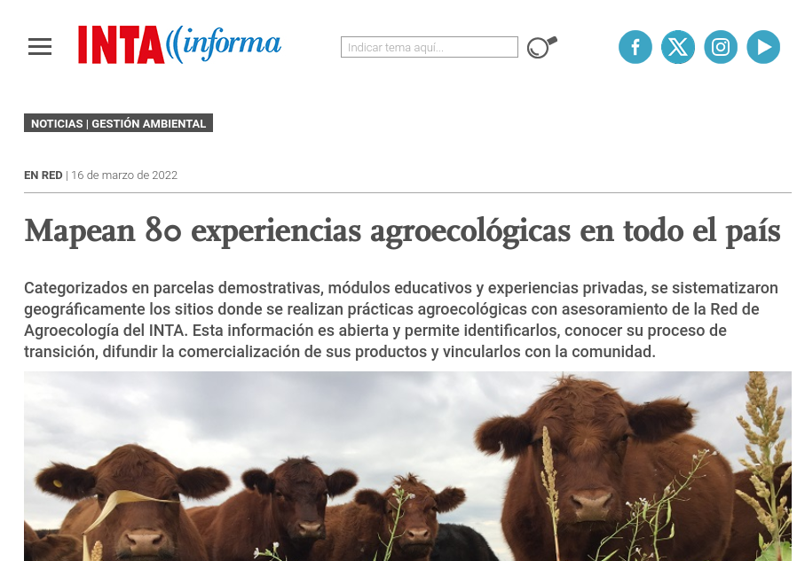{height=7cm}

## El mapeo de producciones agroecológicas 


<!-- s (Tuchin, 2020; Red Interregional de Nodos Agroecológicos, 2023; Agencia de Extensión Mar del Plata - INTA y col., 2022; Inta Informa 2022). Sin embargo, todas se encuentran basadas en un servicio de mapas privado, la posibilidad de agregar o modificar información es limitada, y su descarga y reutilización no se encuentra necesariamente en un formato abierto. -->

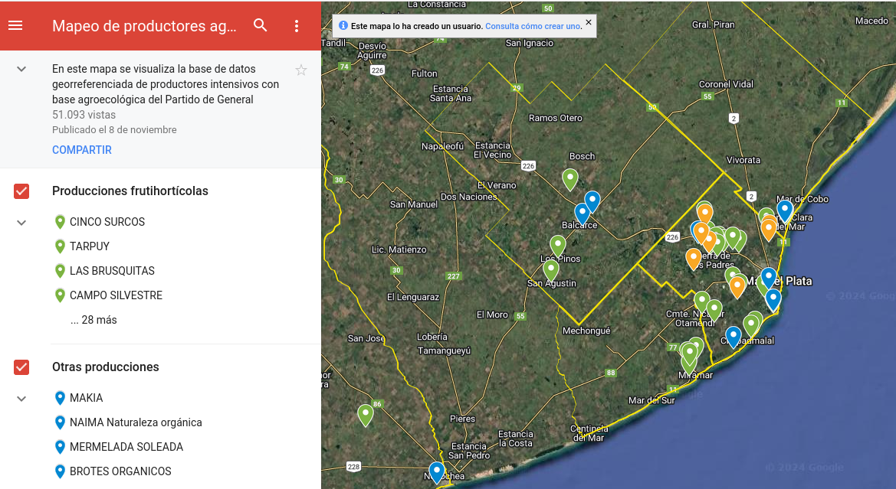{height=6cm}


## El mapeo de producciones agroecológicas 

<!-- s (Tuchin, 2020; Red Interregional de Nodos Agroecológicos, 2023; Agencia de Extensión Mar del Plata - INTA y col., 2022; Inta Informa 2022). Sin embargo, todas se encuentran basadas en un servicio de mapas privado, la posibilidad de agregar o modificar información es limitada, y su descarga y reutilización no se encuentra necesariamente en un formato abierto. -->

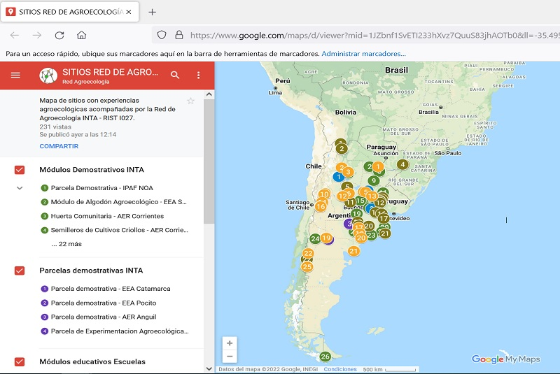{height=6cm}


<!-- * Análisis de los pósters del CPA -->

<!--   cuántos usaron mapas -->
<!--   de qué tipo cada uno, cuántos basados en OSM -->
<!--   tienen atribución -->
<!--   están disponibles abiertamente. -->

## Congreso Provincial de Agroecología.

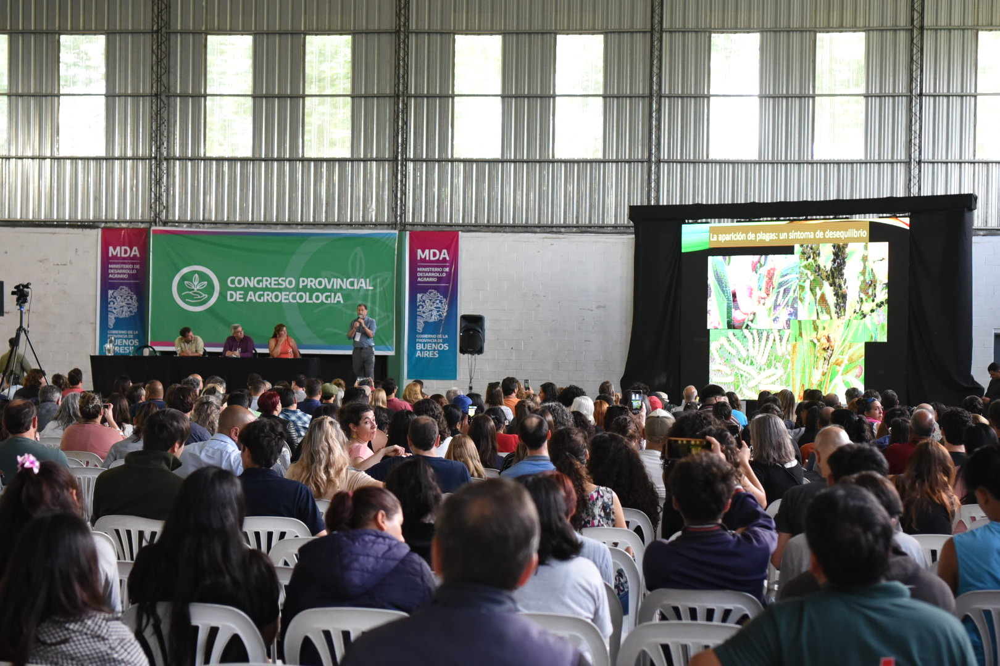{height=6cm}

## Congreso Provincial de Agroecología.

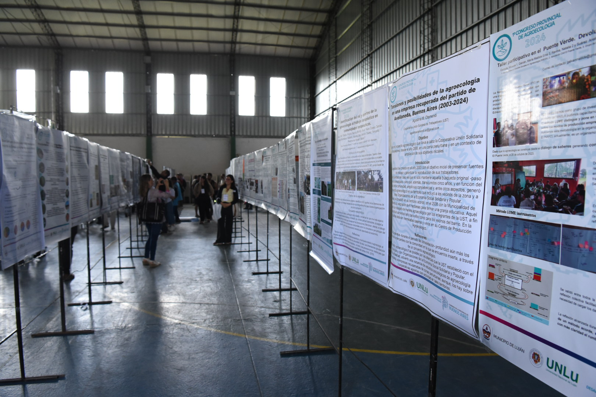{height=6cm}

## Congreso Provincial de Agroecología.

### Cantidad de mapas por publicación

```{r posters, eval=TRUE, echo=FALSE}

#54 publicaciones con mapas

cantidad_de_mapas <- tibble(mapas = datos$Posee.Mapa) %>%  count(mapas)
cantidad_de_mapas$Cantidad <- c(1,2,3,4,5,6)

cantidad_de_mapas$Proporción <- pasar_n_a_proporcion(cantidad_de_mapas$n)
```

```{r grafico-posters, fig.width = 3.5,fig.height=2.5,fig.align='center'}

ggplot(cantidad_de_mapas, aes(x= Cantidad, y = Proporción ))+
  geom_bar(stat = "identity") +
  labs(xlab="Cantidad de mapas")+
  theme_bw()
```

## Presentaciones al Congreso Provincial de Agroecología.

### Cantidad de mapas según mapa base.

```{r mapa-base, echo=FALSE}
google <- tibble( tipo = datos$Tipo.de.mapa.usado) %>%
  mutate(tipo = tolower(tipo),
         match = str_c("google", collapse = '|'),
         key_word = str_extract_all(tipo, match)) %>%
  select(-match)

osm <- tibble(tipo = datos$Tipo.de.mapa.usado) %>% 
  mutate(tipo = tolower(tipo),
         match = str_c("openstreetmap", collapse = '|'),
         key_word = str_extract_all(tipo, match)) %>%
  select(-match)

cuantos_usan_google <-  unlist(google$key_word, use.names = FALSE) %>% length()
cuantos_usan_osm <-  unlist(osm$key_word, use.names = FALSE) %>% length()

otros <- 54 - cuantos_usan_google - cuantos_usan_osm

servicios <- tibble(categoria = c("Servicios de Google", "OpenStreetMap" ,"Otros"),
                n = c(cuantos_usan_google, cuantos_usan_osm  , otros ))


servicios$proporcion <- pasar_n_a_proporcion(servicios$n)
```

```{r grafico-mapa-base, fig.width = 3.5,fig.align='center'}
ggplot(servicios, aes(x = "", y = proporcion, fill = categoria))+
  geom_col(color = "black")+
  geom_text(aes(label = categoria), position = position_stack(vjust = 0.5))+
  coord_polar(theta = "y")+
  #labs(title  = "Servicios Utilizados")+
  theme(axis.text = element_blank(),
        axis.ticks = element_blank(),
        axis.title = element_blank(),
        panel.grid = element_blank(),
        panel.background = element_rect(fill = "#ebf2ff"),
        plot.background = element_rect(fill = "#ebf2ff"),
        legend.position = "none")
```

## Objetivos

La producción de este tipo de información por parte de las instituciones u organizaciones públicas utiliza herramientas que se transforman en barreras que dificultan el acceso, tanto para su reinterpretación como para su mejora.

<!-- Con la metodología propuesta se busca contribuir a favorecer instancias de construcción de conocimiento, a partir del mapeo de problemas, fortaleciendo vínculos comunitarios. Del mismo modo, realizar un aporte para la construcción de políticas públicas basadas en información relevante y validada por los actores de la producción agroecológica. -->

- Favorecer instancias de construcción de conocimiento.

- Fortalecer vínculos comunitarios.

- Realizar un aporte para la construcción de políticas públicas. 

<!-- - Esta presentación busca compartir los resultados y desafíos de esta experiencia. -->


## Metodología

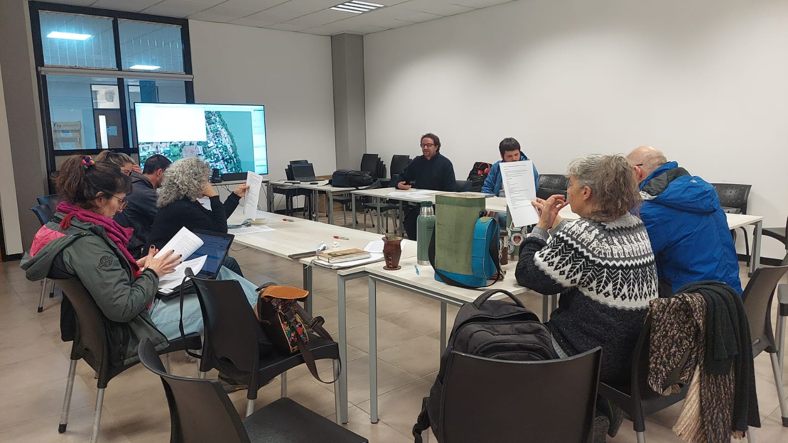

<!-- - Se propuso la construcción de una cartografía colaborativa de los emprendimientos agroecológicos del partido, y de su entorno ecológico y ambiental utilizando OpenStreetMap. -->

<!-- - Se propuso la implementación de un proceso participativo para la construcción de criterios respecto de los datos relevantes, su sistematización y la apropiación de herramientas para la construcción de mapas colaborativos. -->

<!-- * La etiqueta en OSM -->

# Una etiqueta en OSM

## Propuesta de la etiqueta $agroecology = *$

En OSM no existía una etiqueta específica para denominar los sitios de dedicados a la agroecología, ya sean comercios o específicamente productores y establecimientos productivos.


## Propuesta de la etiqueta $agroecology = *$

Por otro lado, una etiqueta como $organic = *$ se utiliza para describir _si una tienda o restaurante ofrece productos orgánicos_ 

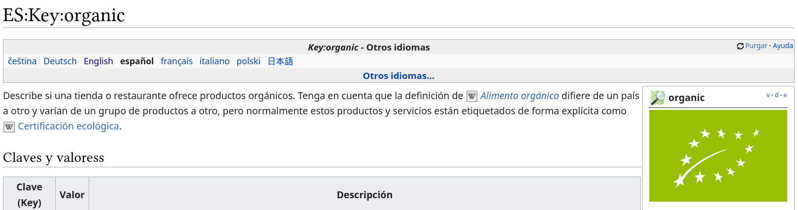

## Propuesta de la etiqueta $agroecology = *$


En muchos lugares del mundo la certificación orgánica conlleva un costo financiero importante para las familias productoras. 

Como resultado, las comunidades de productores están desarrollando sus propios sellos y sistemas participativos de garantías (SPG) para certificar sus prácticas agroecológicas [@Lemeilleur2020; @Fernandez2018] .

<!-- Por eso se exploró la creación de una etiqueta específica.  -->

## Propuesta de la etiqueta $agroecology = *$


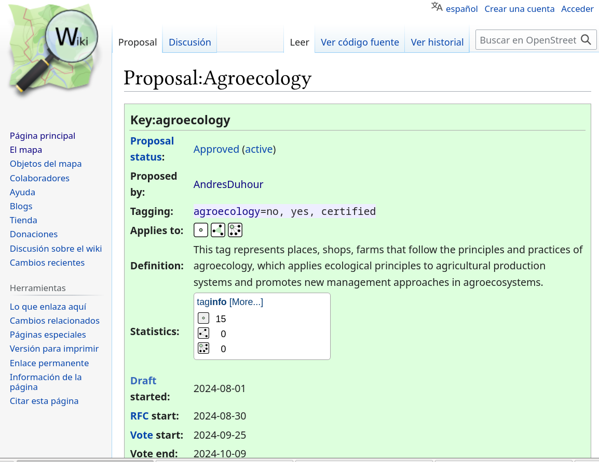{height=6cm}

## Propuesta de la etiqueta $agroecology = *$


## Propuesta de la etiqueta $agroecology = *$

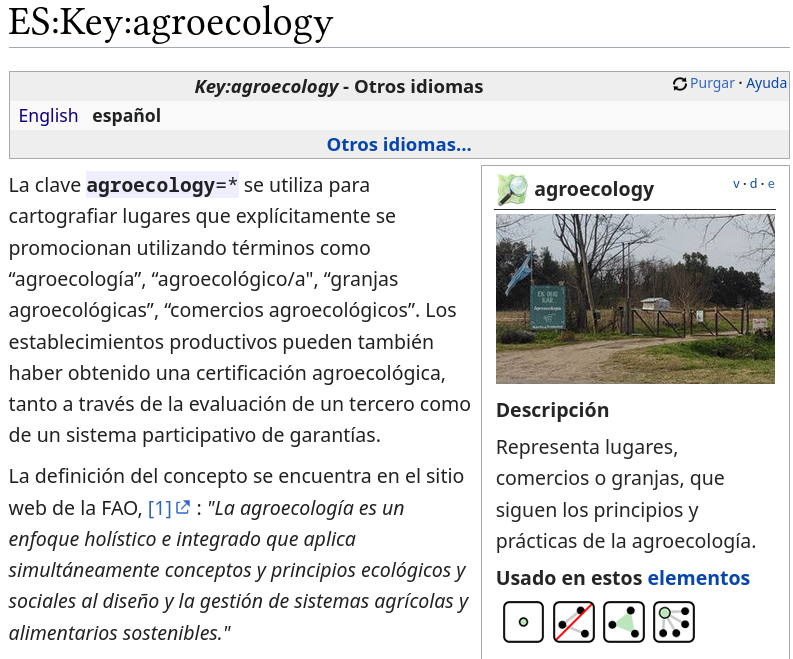{height=6cm}

## Propuesta de la etiqueta $agroecology = *$

### ¿Cómo mapear?

1. Si el lugar se describe explícitamente con los términos "agroecológico" o "agroecología", agregar la etiqueta _agroecology=yes_.

{height=6cm}

## Propuesta de la etiqueta $agroecology = *$

### ¿Cómo mapear?

2. Si cuenta con una certificación de sus prácticas agroecológicas, agregar la etiqueta _agroecology=certified_

{height=5cm}

<!-- * El proyecto en Argentina -->


<!-- * El mapa de luján -->

## Mapa de Luján

```{r mapa, fig.height=6}

# area <- "Partido de Luján"
# area <- getbb(area, format_out = "sf_polygon")
# bbox <- st_bbox(area)
# area_opq <- opq(bbox,timeout = 50)
# 
# agroecology <- add_osm_feature(area_opq,key = "agroecology") |>
#   osmdata_sf()
# 
#                      # subset(agroecology$osm_polygons, 
#                      #        subset = !is.na(agroecology),  
#                      #        select = c("agroecology","place","shop"))
# 
# 
# 
# almacen <- agroecology$osm_points
# almacen <- subset(almacen, subset = almacen$shop == "convenience",select = "shop")
# names(almacen)[1] <- "Tipo"
#   
# prod <- agroecology$osm_points
# prod <- subset(prod, subset = prod$place == "farm",select ="place")
# names(prod)[1] <- "Tipo"
# 
# feria = agroecology$osm_points
# feria = subset(feria, subset = feria$amenity == "marketplace",select = "amenity")
# names(feria)[1] <- "Tipo"
# 
# 
# agroecology <- rbind(almacen,feria,prod)
# 
# write_sf(agroecology,"agroecology.geojson")

agroecology <- read_sf("../agroecology.geojson")
lujan <- read_sf("../lujan.geojson")

map <- tm_shape(lujan) + tm_borders() +
tm_shape(agroecology) + tm_symbols(fill = "red", 
                                 shape="Tipo") 
  #tm_basemap() 
  #+ tm_scalebar()
map
```

## Mapa de Luján

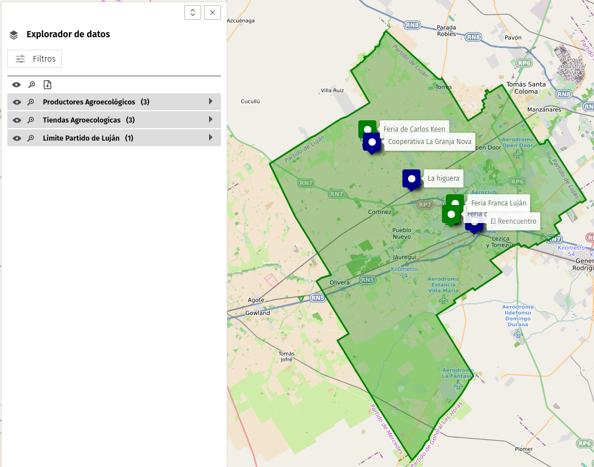{height=6cm}

## Conclusiones

`r fa("check", fill = "green")` OpenStreetMap, como herramienta colaborativa, puede integrarse con la comunidad de la producción agroecológica.


`r fa("check", fill = "green")` Es necesario continuar el mapeo del sector rural en OSM.

<!-- `r fa("check", fill = "green")` -->


# Referencias

## Referencias{.allowframebreaks}
