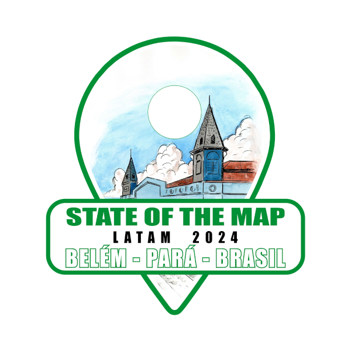

```{r setup, include=FALSE}
knitr::opts_chunk$set(echo = FALSE)
```

# Introducción


<!--  -->


## Introducción

En la República Argentina se han fortalecido organizaciones de productores y productoras que llevan adelante sus emprendimientos en el marco de la Agroecología, se han creado redes de comercialización y se han implementado sistemas participativos de certificación y de garantías. 

En conjunto con ello, se han sancionado normativas que limitan el uso de agroquímicos en diferentes jurisdicciones y se han iniciado procesos de reconversión de las producciones existentes. 

## Introducción

Este proceso de promoción y fortalecimiento de planteos productivos novedosos se enmarca en un entorno sociocultural y ambiental de disputa con otros modelos productivos y del uso y apropiación de los recursos naturales y también de uso y apropiación de los saberes y conocimientos, en tanto bienes comunes.


El partido de Luján, Provincia de Buenos Aires,  presenta una configuración territorial que guarda relación con los cambios productivos y sociales que se registran en la región en las últimas décadas, y que se manifiestan en forma de conflictos entre usos del suelo agropecuarios y residenciales que pugnan en un área de interfase.


## Introducción

El conocimiento y análisis de estos procesos no puede ser ajeno a los actores involucrados, productores, consumidores, sus organizaciones, en interacción con instituciones estatales específicas del sector agropecuario y las vinculadas a la educación y la investigación.

Para la promoción de modelos productivos alternativos también es necesaria una apertura del acceso a la información local, de tipo geográfica, que no necesariamente está disponible abiertamente y tampoco es ajena a procesos de cercamiento y privatización. 

<!-- * Antecedentes en general del uso de mapas para la agroecología. tomar del proyecto de extensión -->

## Introducción

La producción de este tipo de información por parte de las instituciones u organizaciones públicas utiliza distintas barreras que dificultan su acceso, tanto para su reinterpretación como para su mejora.

La información de tipo geográfica, tanto desde el conocimiento territorial de las y los ciudadanos como desde la producción que se realiza en las instituciones públicas constituyen un bien común digital, y por lo tanto es necesario "levantar" esas barreras haciendo estos datos de acceso libre.

A partir de una demanda respecto de la sistematización de la información relativa a la producción agroecológica en el municipio de Luján, se propuso la implementación de un proceso participativo para la construcción de criterios respecto de los datos relevantes, su sistematización y la apropiación de herramientas para la construcción de mapas colaborativos.


Esta propuesta de ponencia busca compartir los resultados y desafíos de esta experiencia.

## Metodología

Al efecto, se propuso la construcción de una cartografía colaborativa de los emprendimientos agroecológicos del partido, y de su entorno ecológico y ambiental utilizando OpenStreetMap, teniendo en cuenta que permite el aporte de múltiples datos de tipo geográfico, su uso con diferentes aplicaciones y dispositivos, y se garantiza su disponibilidad pública mediante una licencia de uso adecuada.

Con la metodología propuesta se busca contribuir a favorecer instancias de construcción de conocimiento, a partir del mapeo de problemas, fortaleciendo vínculos comunitarios. Del mismo modo, realizar un aporte para la construcción de políticas públicas basadas en información relevante y validada por los actores de la producción agroecológica.

## Otros


## Presentaciones al Congreso Pronvincial de Agroecología.

<!-- * Análisis de los pósters del CPA -->

<!--   cuántos usaron mapas -->
<!--   de qué tipo cada uno, cuántos basados en OSM -->
<!--   tienen atribución -->
<!--   están disponibles abiertamente. -->


<!-- * La etiqueta en OSM -->

## Una etiqueta en OSM

<!-- * El proyecto en Argentina -->


<!-- * El mapa de luján -->


